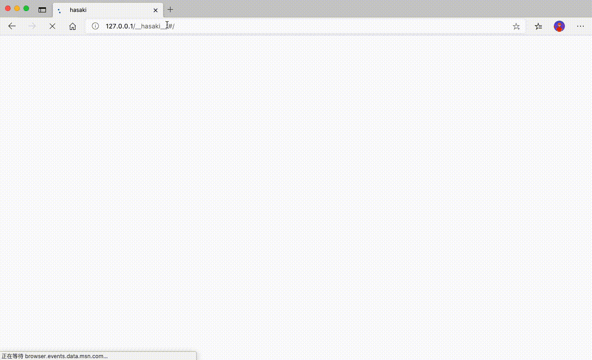

## Hasaki!
> 面对疾风吧!



## run!

```bash
docker run -p 80:80 charlzyx/hasaki
```

## enjoy!
[http://localhost/\_\_hasaki\_\_](http://localhost/__hasaki__)

## 帮助文档
- [nginx location](http://nginx.org/en/docs/http/ngx_http_core_module.html#location)
- [nginx location 中文](https://juejin.im/post/6844903849166110733)
- [Web UI](https://github.com/charlzyx/hasaki-ui)
